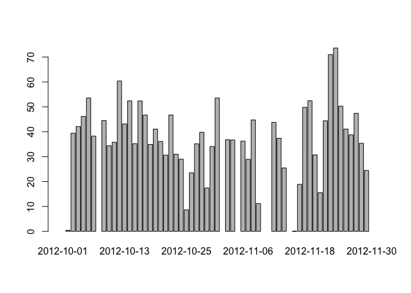
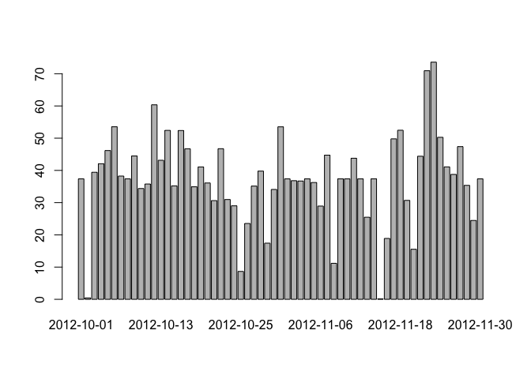
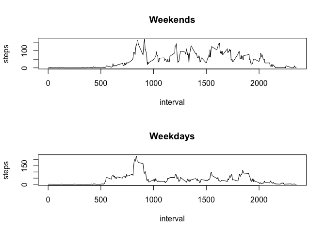

# Reproducible Research: Peer Assessment 1


## Loading and preprocessing the data


```r
activity <- read.csv(unz('activity.zip','activity.csv') , 
                     stringsAsFactors=FALSE)
activity$date <- as.Date(activity$date, format="%Y-%m-%d")
```

## What is mean total number of steps taken per day?


```r
daily <- tapply(activity$steps, activity$date, mean, na.rm=TRUE)
mean_daily_steps <- mean(daily, na.rm=TRUE)
median_daily_steps <- median(daily, na.rm=TRUE)
barplot(daily)
```

<!-- -->

The mean steps are 37.3825996 and the median 37.3784722.

## What is the average daily activity pattern?


```r
mean_interval_steps <- tapply(activity$steps, activity$interval, mean, na.rm=TRUE)
plot(x=as.numeric(names(mean_interval_steps)), y=mean_interval_steps, type="l", ylab="steps", xlab="interval")
```

<!-- -->

The interval with the maximum activity is 104.

## Imputing missing values


```r
activity <- read.csv(unz('activity.zip','activity.csv') , 
                     stringsAsFactors=FALSE)
activity$date <- as.Date(activity$date, format="%Y-%m-%d")

filled_steps <- c()

for ( i in 1:nrow(activity)){
    a <- activity[i,]
    if (is.na(a$steps)) {
      v <- mean_interval_steps[as.character(a$interval)]
    } else {
      v <- a$steps
    }
    filled_steps <- c(filled_steps, v)
}
activity$steps <- filled_steps

daily <- tapply(activity$steps, activity$date, mean, na.rm=TRUE)
mean_daily_steps <- mean(daily)
median_daily_steps <- median(daily)
barplot(daily)
```

<!-- -->

The mean steps are 37.3825996 and the median 37.3825996.

## Are there differences in activity patterns between weekdays and weekends?

He walks more during weekends.


```r
# Weekdays uses the locale name so I use variables to refere it, change it here if necesary

saturday <- "sábado"
sunday <- "domingo"

activity$weekend <- factor(sapply(weekdays(activity$date), function(x) {
  if (x %in% c(saturday, sunday))
    "weekend"
  else
    "weekday"
}))

par(mfrow=c(2,1))

activity_weekend <- subset(activity, weekend == "weekend")
mean_interval_steps <- tapply(activity_weekend$steps, activity_weekend$interval, mean, na.rm=TRUE)
plot(x=as.numeric(names(mean_interval_steps)), y=mean_interval_steps, type="l", ylab="steps", xlab="interval", main="Weekends")

activity_weekday <- subset(activity, weekend == "weekday")
mean_interval_steps <- tapply(activity_weekday$steps, activity_weekday$interval, mean, na.rm=TRUE)
plot(x=as.numeric(names(mean_interval_steps)), y=mean_interval_steps, type="l", ylab="steps", xlab="interval", main="Weekdays")
```

<!-- -->

